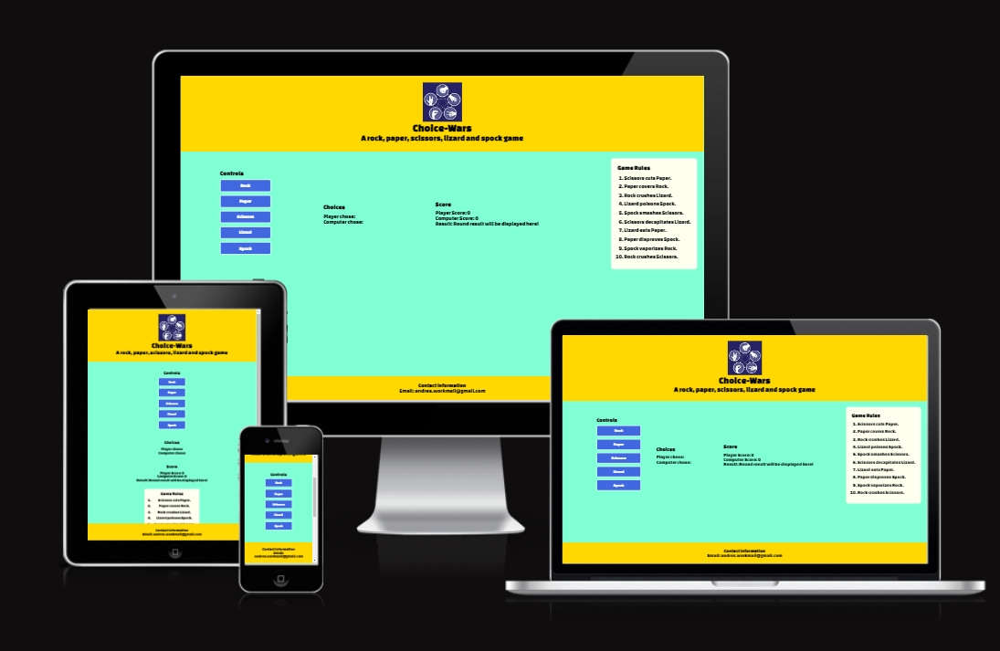
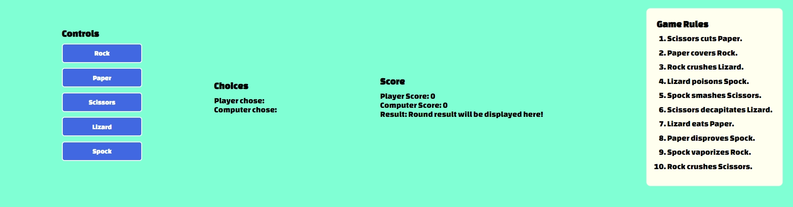
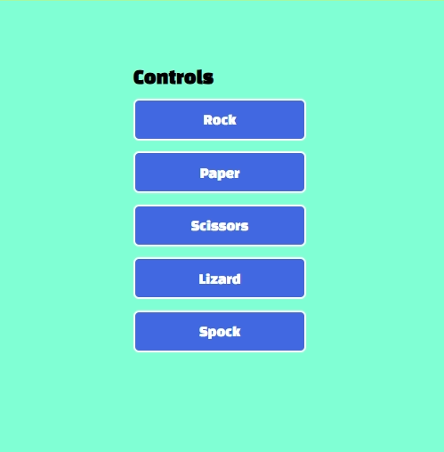
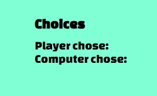
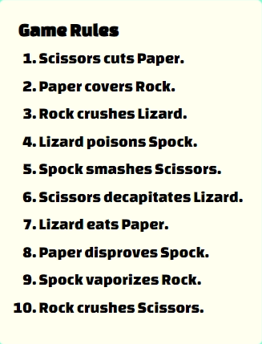

# Rock, paper, scissors, lizard and Spock game

[Rock, paper, scissors, lizard and Spock game] (https://flyhighhher.github.io/choice-wars/)

This website is created on the Rock, Paper, Scissors, Lizard, Spock game based from the TV series The Big Bang Theory. The game is an expansion on the game Rock, Paper, Scissors. In this version the player is playing against computer and picks a variable and reveals it at the same time. The winner is the one who defeats the others. In a tie, the process is repeated until a winner is found. The maimum rounds are 5.

## Purpose of the project

The website's purpose is to provide a fun and interactive experience for users. In this game, players make choices (e.g., "Rock," "Paper," "Scissors," "Lizard," or "Spock") and compete against a computer opponent. The goal of the game is to win rounds and ultimately the game itself.

## Features

- **Game Concept**
- The website is designed as a game where users can play a variation of the classic "Rock, Paper, Scissors" game with additional choices "Lizard" and "Spock". The game is meant to provide and enganing and interactive experience for users.
- **Styling and Design**
- The website is styled using CSS to provide an appealing and visually engaging user interface. It uses Google Fonts to enhance the typography, and it features a header, main game area, rules section, and a contact information footer.
- **HTML Structure**
- The website's structure is based on semantic HTML elements. It includes a header, main content area, and footer for structural clarity.
- **Header**
- It includes the game logo, the game title "Choice-Wars", and a brief description of the game.

- **Main Game Area**

- The main game area is divided into three sections:
- *Game Controls Area: This section contains buttons for making choices in the game. Users can select from "Rock", "Paper", "Scissors", "Lizard", and "Spock". The user's choice is compared to computer's choice.

- *Choices: This section displays the choices made by the player and the computer after each round.

- *Score Area: It keeps track of the player's score, computer's score, and displays the result of each round.

- **Game Rules**
- The website provides a section that explains the rules of the game, which involve the interactions between the different choices (e.g "Scissors cuts Paper," "Paper covers Rock"). This helps user to understand the game mechanics.

- **Contact Information**
- The footer section provides contact information, including an email address for inquiries.

- **JavaScript Functionality**
- JavaScript code is included to add game functionality. Users can click on the buttons to make their choices, and the game logic determines the winner and updates the scores and results.
- **Responsiveness**
- The website is designed to be responsive, as indicated by media queries in the CSS, which adjust the layout and styling for smaller screens.
  
## Testing

The website was tested on different web-broswers: Google Chrome and Opera GX.
The inspection tool was also used in order to check the functionality on different devices.
All the buttons on the webpage are functioning as supposed to.

## Bugs

The footer seemed to appear in the middle of the screen when inspecting on some different devices. The bug was fixed with adding the position: fixed; in the style.css footer section.
The headers were corrected in order it to follow the logical HTML structuring norms.

## Validator Testing

- HTML
  No erros or warnings were shown when running through the validator.
  
- CSS
  When used the CSS validator through the URL then it seems that there might be an issue with Google Fonts and it returns a lot of errors and warnings. However when used the direct input method there were no errors or warnings found.
  
- JavaScript
  No errors were found when running through the JavaScript validator (jshint.com)
  [JShint](assets/images/jshint.png)

- Accessibility
- Mobile lighthouse: [Lighthouse](assets/images/mobile-lighthouse.png)
- Desktop lighthouse: [Lighthouse](assets/images/desktop-lighthouse.png)

